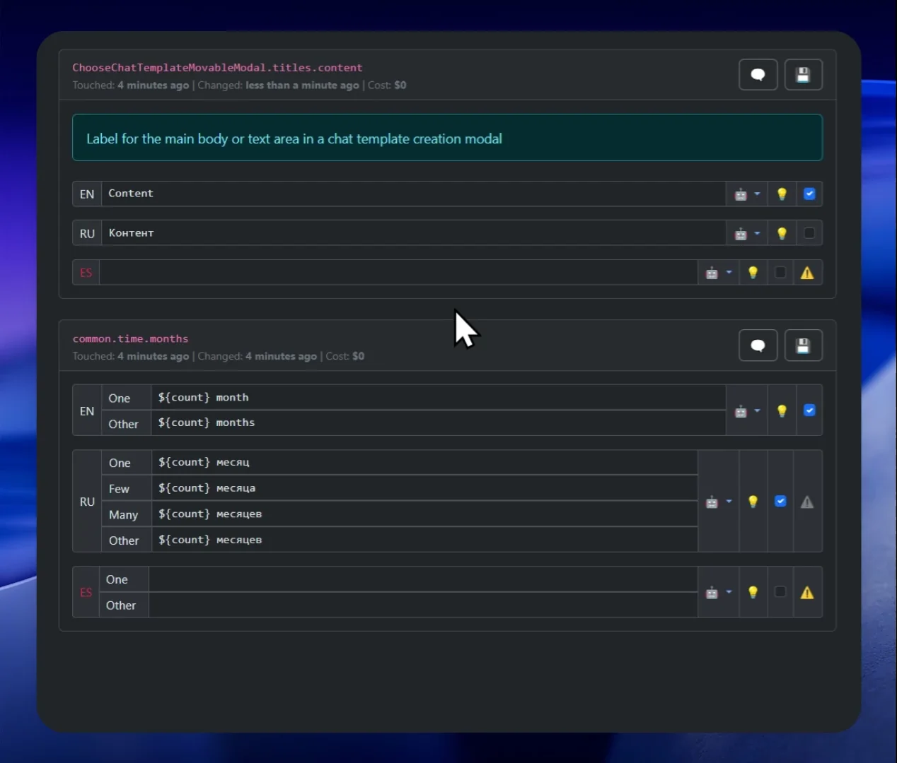
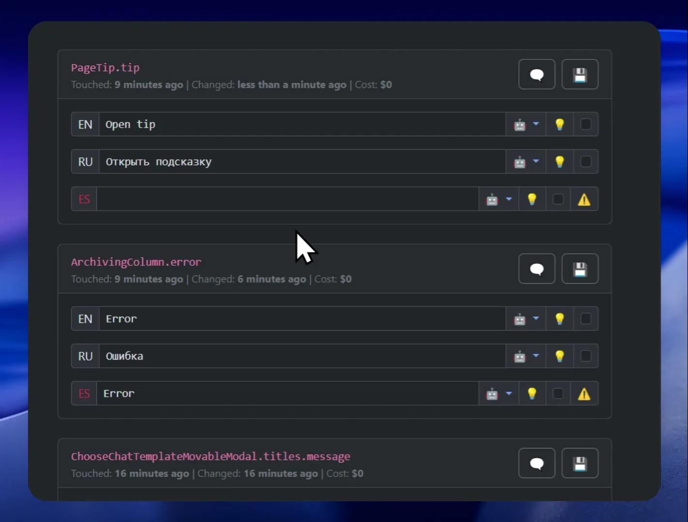
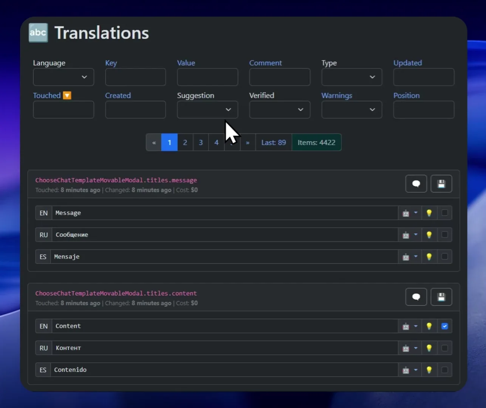

<p align="center">
  
</p>

[Russian](readme.ru.md) | [English](readme.md)

# Lokilizer – Open Source Tool for App Localization and Translation

## 🚀 Project Overview

This tool helps you localize and translate applications into multiple languages using any LLM model compatible with the OpenAI API (`chat/completions`).  
All you need is to provide your API tokens (e.g., for ChatGPT 4.1 or DeepSeek — both are preconfigured in the settings).

> **Disclaimer**: The shoemaker’s children go barefoot 🙈  
> The translation app itself is only in English! Maybe someday I’ll rewrite it in React with a beautiful frontend and more transparent technologies, but for now, it is what it is. But — it works!

### Translate


### Validation


### Searching & Filtering


---

## 🎯 Key Features

### 🌐 Dual-Source Translation

A unique feature: translation is done not just from a single language, but from two at once.  
For example, if your native language is Russian and you also know English, you can provide both.  
When adding new languages, Lokilizer doesn't just translate words — it analyzes context and meaning from both languages, ensuring higher translation quality.

### 🧠 Context and Line Analysis

Before translating each string, Lokilizer:
- Analyzes neighboring strings and their context
- Passes them to the LLM, requesting a comment about the meaning and use of the translated string
- Only then performs the translation  
  **This dramatically improves translation quality!**

### 📜 Glossary

- The glossary is created manually: a short app summary, key terms, and their correct translations.
- Control the translation and consistency of key terms.
- Adding a new language is automated: term translations are generated considering all existing languages. Easy to adjust manually.
- You can create "special glossaries" for specific key prefixes (optional).

---

## 🔤 About String Translations

- **Supported formats:** Currently only JSON (flat & structured) with [i18next](https://www.i18next.com/) pluralization.
  - Pluralization: both `cardinal` and `ordinal` forms are supported  
    **Example:**
    ```json
    {
      "key_one": "1 file",
      "key_other": "{{count}} files"
    }
    ```
    New file formats can be easily added.
- **Placeholders:** `${likeJs}`, `{{doubleCurve}}`, `{singleCurve}` — new formats can be added easily.  
  Preferred format is set in the project settings.
- **String order** is preserved! This is important for meaning and for LLM context.
- **Multiline strings:** supports `\r` and `\n` (configurable).
- **Comments for strings:** you can add explanations that are stored only in the app.  
  By default, comments are generated by the LLM.
- **Suggested value:** can be specified separately (by a human translator or via AI Suggest).
- **Bulk or single translation**, choosing the LLM for each language.
- **Reuse of translations:** in bulk mode, already translated identical strings are reused.
- **History of strings and translations:** old strings and translations are never deleted — everything is kept, which partially covers git branching use-cases.

---

## 🛡️ Translation Validation

All uploaded and translated strings are checked and get a `⚠️ Warning` flag if:
- The translation string is empty
- There are leading or trailing spaces
- The string contains multiple consecutive spaces
- The string is not translated and matches the main or secondary language (with exceptions: `email`, `api`, `ip`, `url`, `uri`, `id`)
- A `{{placeholder}}` present in the main language is missing in the translation
- The translation contains an obsolete `{{placeholder}}` that's not in the main language anymore
- Line breaks (`\r` or `\n`) in the main language and translation do not match
- Number of colons `:` in the main language and translation do not match
- A required plural form for the target language is missing
- An extra plural form exists that should not be present for the target language
- Plural forms have different numbers of line breaks or colons

Regardless of validation, a user can manually mark a string as verified, which allows for flexible filtering and bulk translation management.

---

## 🏭 Bulk Operations

- `🔤 AI Batch translate` — bulk translation of all strings into a new language
- `💡 AI Batch suggest` — AI-powered suggestions (e.g., error correction, adding diacritics); you write the prompt, and results can be accepted or rejected manually
- `✂️ Batch modify` — bulk removal of comments, suggestions, trailing spaces, or translations

---

## 🛠️ Tools

- `📢 Alert message` — set a system notification right in the interface. For example, a translator can ask others not to run bulk operations while they're working.
- `🔠 Text translate` — translate arbitrary texts using the LLM and your glossary (e.g., for blog news).
- `🔢 Plurals` — pluralization forms and examples for the selected language  
  [Unicode CLDR source](https://www.unicode.org/cldr/charts/47/supplemental/language_plural_rules.html)
- `🏘️ Groups analyzer` — analyze large/small groups of strings (parent keys in JSON); helps detect orphaned strings and clean up.
- `👯 Duplicate analyzer` — find duplicate strings, maintain translation consistency.
- `🕳️ Loosed placeholders analyzer` — find strings that should use a placeholder but don't (e.g., if concatenation is used instead of a placeholder).

---

## 🏢 Projects, Users & Roles

- Unlimited projects, with isolation of translations and all related data.
- Project backup and restore (including partial restore, e.g., just the glossary).
- Any number of users per project with different roles:
  - **Admin** — full access
  - **Developer** — everything except user and LLM management
  - **Translator** — can work only with assigned languages, edit the glossary, and set `📢 Alert message`
  - **Guest** — view only
  - 

## 🛡️ License and Usage

**Lokilizer** is free for personal and internal business use, including translation/localization of commercial products.

- You may **not** sell, rent, sublicense, provide as a paid service, publish on marketplaces, or use as a SaaS/cloud/hosting solution for third parties without explicit written permission from the author.
- All embedded donation and promotional links by the author must be retained and may not be removed, hidden, or altered.
- Commercial redistribution, hosting, or provision of the software as a service is strictly prohibited.
- You may use Lokilizer to localize your own commercial products, as long as you do not provide the application itself as a product or service to others.

The author reserves the right to monetize the app via embedded ads and donation links.

For special commercial licensing, contact the author.